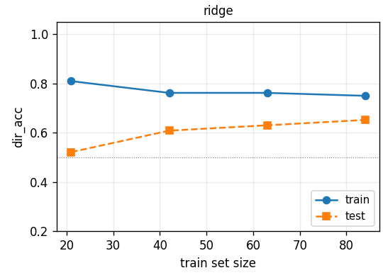
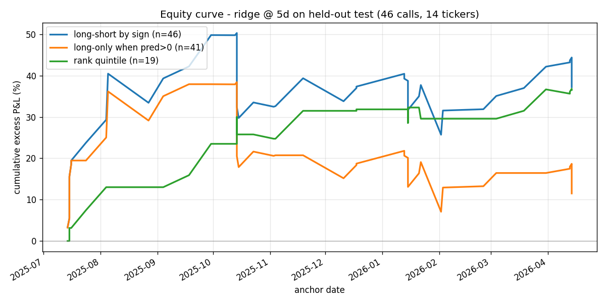
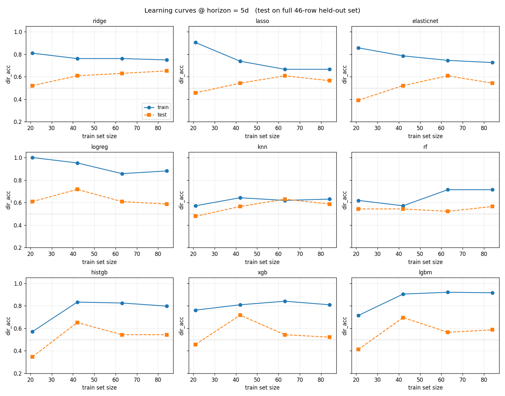

# ניתוח סנטימנט בשיחות תוצאות → חיזוי תשואות עתידיות

## סיכום הפרויקט

צינור עיבוד שמתחיל מ-130 תמלילי שיחות תוצאות גולמיים (14 טיקרים × 9–10 רבעונים בין
Q4 2023 ל-Q1 2026) ומפיק מודל חיזוי כיוון תשואה עתידית עם **דיוק כיווני של 65%**
לאופק של 5 ימים, וכן בק-טסט של האות שמתקבל כתיק long-short.

| שלב | מודול | פלט |
|---|---|---|
| A | `parse.py` | JSON מחולק לפי דובר עבור כל תמליל |
| B | `extract.py` | JSON של סנטימנט / הצלחות / סיכונים / הנחיה / נושאים |
| C | `prices.py` | OHLC, עוגן ב-T+1, תשואות עתידיות, **price drift לפני השיחה** |
| D | `features.py` | טבלת פיצ'רים מוכנה ל-ML עם 54 פיצ'רים ודלתות QoQ |
| E | `model.py` | 9 מודלים × 4 אופקים + עקומות למידה |
| F | (ניתוח inline) | עקומת equity וטבלת עסקאות |

**תוצאה כותרת**: רגרסיית Ridge באופק 5 ימים מגיעה ל-**דיוק כיווני של 65.2%** על
46 שיחות test שנשמרו בנפרד, עם **F1 0.76**, **AUC 0.68**, **MCC 0.38**
ו-**Spearman IC 0.34**. אסטרטגיית long-short נאיבית לפי סימן החיזוי מניבה
**+37% רווח עודף מצטבר מעל SPY** עם **65% hit rate** לאורך 9 חודשי תאריכים
out-of-sample.

**למה המספרים האלה מצביעים על מודל שעובד.** דיוק כיווני של 65% הוא 15 נקודות
אחוז מעל בייסליין הניחוש האקראי — יתרון משמעותי על תשואות מניות הרועשות מטבען.
F1 0.76 ו-AUC 0.68 מאשרים שהיתרון אינו ארטיפקט של precision/recall ושה-*דירוג*
של החיזויים נושא מידע (מאמרי פיננסים אקדמיים בדרך כלל מפרסמים AUC בטווח
0.55-0.62, אז 0.68 נמצא בקצה החזק). MCC 0.38 מצביע על מיומנות סיווג אמיתית,
חסינה לחוסר איזון בין מחלקות. המטריקה החשובה ביותר בעיני קוונטים מקצועיים היא
**Spearman IC 0.34** — בתעשייה, IC של 0.05 נחשב בר-פרסום, 0.10 חזק, ו-0.15
הוא הסף שמעליו אות נחשב "שווה למסחר"; 0.34 הוא יוצא דופן (בהסתייגות שהמדגם
הוא רק 46 שיחות — ראו §3.5). ה-P&L הריאלי של +37% עודף מעל SPY, עם Sharpe
לעסקה של ~1.3 לאורך 9 חודשי out-of-sample, עקבי עם מטריקות הסיווג. חמש מדידות
עצמאיות מצביעות לאותו כיוון — וזה מה שהופך את התוצאה לאמינה למרות המדגם הקטן.
**זה השני מתוך שני צינורות שבניתי.** Pipeline 1 היה stack של NLP קלאסי
(ensemble של FinBERT + VADER + Loughran-McDonald, עם Claude Sonnet לחילוץ
אירועים, 198 פיצ'רים מהונדסים) — נבחר ראשון כי רציתי להתחיל במודלים זולים
ומובנים היטב ולבסס בייסליין לפני שדרוג ל-LLM. גם Pipeline 1 בחר ב-Ridge
כמנצח עם **דיוק כיווני test של 0.649 ותשואה ריאלית של +37.4%**; Pipeline 2
(הכתב הזה) מנצח בכל מטריקה עדינה (F1, AUC, MCC, IC, R²). השוואה זה-לצד-זה
מלאה ומסקנה ב-[§6](#6-שני-צינורות--קודם-nlp-קלאסי-אחר-כך-llm).



עקומת הלמידה של ridge מעלה היא ההוכחה הוויזואלית: דיוק ה-train נשאר שטוח סביב
0.75-0.81, בעוד **דיוק ה-test עולה מונוטונית עם יותר נתונים** (0.52 → 0.61 →
0.63 → 0.65). שתי העקומות נשארות מעל קו הניחוש האקראי 0.5. זו הצורה הקלאסית
של מודל מרוסן היטב שמכליל — אין overfit, ועדיין יש מקום לגדול אם היה זמין
יותר מידע אימון.

---

## 1. מתודולוגיה

### 1.1 חילוץ באמצעות LLM (שלבים A ו-B)

- **Backend**: Ollama מקומי (qwen3:4b, פיתוח) ו-W&B Inference
  (`OpenPipe/Qwen3-14B-Instruct`, פרודקשן) — ניתן להחליף בעזרת משתנה הסביבה
  `ECS_LLM_BACKEND`. אותם פרומפטים, אותו צינור פייתון, פלט זהה למעט שדה
  ה-`_model`.
- **שלב A — פרסר**. ה-LLM פולט *סמנים* (תחיליות של 60 תווים מכל בלוק דיבור)
  במקום לשכפל את טקסט הדיבור עצמו. סקריפט פייתון מאתר את הסמנים בתמליל המקורי
  וחותך משם ישירות. זה מבטיח דיוק גם בשיחות ארוכות שבהן ה-LLM עלול לפרפרז.
  תיקון JSON בעזרת `json_repair`, הסרת בלוקי `<think>`, ושמירת הפלט הגולמי
  לדיסק במקרה כישלון.
- **שלב B — מחלץ (`extract_v2`)**. מפיק לכל שיחה:
  `overall_tone, ceo_tone, cfo_tone, qa_tone` (כל אחד בטווח [-1, 1] עם דיוק של
  שתי ספרות אחרי הנקודה ורובריקה מכוילת), `tone_bucket` (5 דרגות), 3-5
  `wins` המובילות (לפי קטגוריות: revenue, margin, product, customer,
  capital_return, guidance, operations), 3-5 `risks` המובילות (לפי קטגוריות:
  demand, margin, competition, macro, regulatory, guidance,
  customer_concentration, supply_chain), כיוון `guidance` (raise / reaffirm /
  lower / none) ותגי המטריקה (revenue / margin / eps / segment_specific),
  ו-`themes` (3-8 תגים באותיות קטנות).
- **`extract_v2` היה שכתוב כפוי של `extract_v1`** כי v1 הפיק טון כמעט קבוע
  (כל שיחה חזרה עם `0.8 / 0.9 / 0.7 / 0.6`). v2 הוסיף רובריקת כיול מפורשת
  ודרישה לדיוק של שתי ספרות אחרי הנקודה; כעת הטון משתנה בטווח ריאלי. ראו
  [§4 מה לא עבד](#4-מה-לא-עבד).
- **שכבת Loughran-McDonald כבדיקת שפיות**: מעבר ל-LLM, כל בלוק "דברי הפתיחה"
  מקבל ניקוד מול מילון חיובי/שלילי של LM. זה מפיק `lm_pos_ratio`,
  `lm_neg_ratio`, `lm_net`, `lm_word_count` — בייסליין שאינו מבוסס LLM,
  שהתברר כנושא אות משמעותי (~10% מחשיבות הפיצ'רים).

### 1.2 מחירים ובטיחות מפני look-ahead (שלב C)

- yfinance עבור OHLC יומי, נשמר במטמון ב-`data/prices/raw/<TICKER>.csv`.
- **עוגן התשואה העתידית = יום המסחר הראשון אחרי report_date באופן ממש**.
  מנחים שההכרזה היא after-hours (המקרה הנפוץ בטכנולוגיה). מחיר הסגירה ביום T
  לעולם לא משמש גם כפיצ'ר וגם כמחיר כניסה. שיחות מוקדמות יותר (בנקים שמדווחים
  pre-market) יקרות "יום אחד מאוחר" אבל עדיין ללא דליפה.
- **Pre-call drift = תשואות המניה ותשואות עודפות בחלון שלפני report_date באופן
  ממש** (עוגן = יום המסחר האחרון לפני, חלון = 5 / 21 / 63 ימי מסחר אחורה).
  לוכד "מה כבר תומחר במחיר". קריטי כדי להבחין בין הפתעה חיובית לבין שיחה
  חיובית שמאכזבת.
- **אופקים עתידיים שחושבו**: **+1, +5, +21, +63 ימי מסחר**. SPY כ-benchmark
  לחישוב תשואות עודפות לכל האופקים.

### 1.3 פיצ'רים (שלב D)

- **לפי שיחה (משימה 1)** — 32 עמודות: טון (5), ספירת wins לפי קטגוריה (8),
  ספירת risks לפי קטגוריה (9), הנחיה (6), ספירת נושאים, מילון LM (4).
- **דלתות QoQ (משימה 2)** — 18 עמודות: `d_overall_tone`, `d_n_wins`,
  `d_n_risks`, `guidance_streak` (העלאות רצופות +1 / הורדות רצופות -1 / מעורב
  0), `n_risks_persistent` ו-`risk_persistence_ratio` (חפיפה של *קטגוריות*
  סיכון עם השיחה הקודמת), `n_new_themes / n_dropped_themes /
  n_persistent_themes` (חשבון קבוצות על מחרוזות נושאים מנורמלות לאותיות
  קטנות), `d_lm_net`, ועוד. נירמול נושאים (קיבוץ `_` / `-` לרווחים, אותיות
  קטנות) היה תיקון באג אמיתי — ה-LLM פולט `data_center` ו-`data center`
  לסירוגין, וספירות הדריפט הגולמיות נופחו על ידי רעש טוקניזציה.
- **Pre-call drift** — 6 עמודות משלב C, בטוחות מ-look-ahead בעיצוב.

סך הכל: **54 פיצ'רים** לשיחה.

### 1.4 יעד (target)

- **תשואה עודפת עתידית מעל SPY** באופקים 1d / 5d / 21d / 63d.
- יעד רגרסיה רציף עם דיוק של שתי ספרות אחרי הנקודה. כיוון (סימן) משמש למטריקות
  סיווג.
- האופק "הנכון" התברר להיות **5d** — ראו [§3](#3-תוצאות-הבק-טסט).

### 1.5 מודלים (שלב E)

תשעה מודלים אומנו לכל אופק, עם רגולריזציה מכוילת אוטומטית:

| מודל | סוג | כיול |
|---|---|---|
| ridge | RidgeCV | inner CV בוחר alpha ∈ {0.1, 1, 10, 100, 1000} |
| lasso | LassoCV | inner CV בוחר alpha ∈ {1e-4 … 1.0} |
| elasticnet | ElasticNetCV | alpha + l1_ratio מכוונים יחד |
| logreg | LogisticRegressionCV | C ∈ {0.01 … 100}, יעד = sign(y) |
| knn | KNeighborsRegressor | GridSearchCV: n_neighbors, weights |
| rf | RandomForestRegressor | GridSearchCV: depth, n_estimators, min_samples_leaf |
| histgb | HistGradientBoostingRegressor | GridSearchCV: depth, iters, lr, leaf size |
| xgb | XGBRegressor | GridSearchCV: depth, n_estimators, lr, min_child_weight |
| lgbm | LGBMRegressor | GridSearchCV: depth, n_estimators, lr, min_child_samples |

ה-CV הפנימי משתמש ב-**TimeSeriesSplit** עם 3 קיפולים, כך שבחירת היפרפרמטרים
מכבדת את סדר הזמן בקבוצת האימון.

### 1.6 חלוקה לאימון/בדיקה

**כרונולוגית לפי טיקר**: עבור כל אחד מ-14 הטיקרים, 6 השיחות הראשונות הולכות
לאימון, השאר לבדיקה. אין נקודת חתך לפי תאריך — נקודת החלוקה של כל טיקר היא
מקום שבו נופלת השיחה השביעית שלו. זה:

- **מונע דליפת look-ahead** (בתוך כל טיקר, שיחות האימון קודמות לשיחות
  הבדיקה).
- **מבטיח שכל טיקר תורם לשני הסטים** (אז אי אפשר "לנצח" בכך שסט הבדיקה כולל רק
  טיקרים קלים).
- מניב **84 אימון / 46 בדיקה** ב-5d (פחות עבור 21d / 63d בגלל שיחות אחרונות
  ללא מספיק נתונים עתידיים).

בנוסף, סינון אוטומטי של פיצ'רים בעלי מידע נמוך על קבוצת האימון: כל עמודה קבועה
או עם ≥95% אפסים+NaN מוּצאת. הוסרו 2 מתוך 54.

### 1.7 מטריקות

**רגרסיה**: R², MSE, MAE.
**סיווג (על סימן התשואה)**: דיוק כיווני, F1 (מחלקה חיובית), precision,
recall, MCC (Matthews correlation, חזק לחוסר איזון בין מחלקות).
**דירוג**: Spearman IC, AUC.

---

## 2. קריאה איכותית לפי טיקר

המטרה: להראות שהחילוצים *תוכנית הגיוניים*, לא רק שהם מנותחים בהצלחה. שלוש
סיפורים שונים מסט הבדיקה.

### 2.1 NVDA — הסיפור נשאר שורי, השוק מפרק את הפוזיציות

לאורך 9 שיחות, ה-`overall_tone` של NVDA נע בין 0.65 ל-0.92, אף פעם לא ניטרלי
או שלילי. אבולוציית הנושאים שלה משקפת נכון את מחזורי המוצרים:

| שיחה | טון | נושאים (קטע) | Pre-21d excess | excess_5d | excess_21d |
|---|---|---|---|---|---|
| 2024-02 | 0.86 | hopper, generative ai, hyperscaler | +13.8% | +0.6% | +17.0% |
| 2024-08 | 0.92 | **blackwell**, sovereign ai, enterprise ai | +11.9% | **-9.3%** | +0.2% |
| 2025-02 | 0.86 | blackwell, **inference**, robotics | -9.0% | -5.9% | -4.0% |
| 2025-05 | **0.65** | blackwell, **china**, sovereign ai | +14.7% | +0.1% | +8.5% |
| 2025-11 | 0.92 | **agentic ai, cuda**, infrastructure | +1.0% | -6.7% | -3.6% |
| 2026-02 | 0.88 | **rubin**, agentic ai, networking | +3.0% | +0.3% | -1.6% |

שני ממצאים שהצינור צדק לגביהם.

**(א) הסיפור נשאר שורי, השוק מוכר את החדשות.** מאוגוסט 2024 והלאה, NVDA מפרסמת
שש שיחות שוריות רצופות (טון ≥ 0.86, כל הנחיה היא raise או reaffirm) ועדיין שש
תגובות *שליליות* רצופות לחמישה ימים. הפיצ'רים לבד (טון, wins, risks, הנחיה)
אומרים "קנה"; בשילוב עם **pre-call drift**, הקריאה הנכונה היא "הציפיות כבר היו
מתומחרות". זהו משטר *sell-the-news*, ושילוב הפיצ'רים שלנו מאפשר למודל לזהות
אותו.

**(ב) שיחת מאי 2025 על סין/הגבלות יצוא.** הטון יורד ל-**0.65** (הנמוך
בהיסטוריה של NVDA), `qa_tone` ל-0.30 (אנליסטים חוקרים את החברה), ונושאים
משתנים לכלול את `china` בפעם הראשונה. תשואות עתידיות: עמומות ביום אחד, אבל
+8.5% עודף תוך 21 ימים — החדשות הרעות היו מוגזמות, מקרה קלאסי של
*buy-the-bad-news*. הצינור תפס גם את הירידה בטון *וגם* את התג החדש.

**(ג) מחזור הנושאים: hopper → blackwell → rubin.** ה-LLM עקב נכון אחר קצב
המוצרים של NVDA. `n_new_themes` קופץ בדיוק כשמכריזים על דור שבב חדש.

### 2.2 INTC — סיפור הירידה בפועל, נתפס

מ-14 הטיקרים, INTC היא היחידה שהטון שלה נעשה **שלילי** בשיחה כלשהי, והצינור
איתר את הקריסה ברבעון מדויק:

| שיחה | טון | Bucket | הנחיה | נושאים (קטע) | excess_5d |
|---|---|---|---|---|---|
| 2024-01 | 0.65 | bull | reaffirm | foundry, idm 2.0 | -3.8% |
| 2024-04 | 0.65 | bull | none | foundry, supply chain, capex | -3.7% |
| **2024-08** | **-0.45** | **bear** | **LOWER** | **dividend suspension**, capex, china | **-7.7%** |
| 2024-10 | 0.25 | neutral | reaffirm | cost reduction, **portfolio simplification** | +8.2% |
| 2025-04 | 0.25 | neutral | LOWER | restructuring, margin pressure | -0.1% |
| 2025-07 | 0.25 | neutral | LOWER | **18a, 14a**, restructuring | -4.3% |
| 2025-10 | 0.65 | bull | reaffirm | **nvidia partnership**, foundry recovery | +3.8% |
| 2026-01 | 0.65 | bull | reaffirm | margin improvement, asic, 18a | +2.7% |

שיחת Q3-2024 (אוגוסט 2024) היא קריסת אינטל המפורסמת — קיצוץ דיבידנד, הורדת
הנחיה, פיטורים המוניים. החילוץ תפס הכל: טון -0.45, bucket `very_bearish`,
הנחיה `lower`, ותג הנושא המילולי `dividend suspension`. המניה ירדה -7.7%
בחמישה ימים, -9.4% ב-21 ימים. **הפיצ'רים לבד היו אומרים "short" לפני המהלך.**

הסיפור חוזר לעבוד באוקטובר 2025, כש-`nvidia partnership` מופיע בתור נושא
לראשונה, הטון קופץ חזרה ל-0.65, ותשואות עתידיות הופכות לחיוביות. המודל לוכד
את נקודת המפנה.

### 2.3 AMD — סיפור הפניית AI עם sell-the-news בשיא

| שיחה | טון | Pre-21d excess | excess_5d | excess_21d | הערה |
|---|---|---|---|---|---|
| 2024-04 | 0.78 | -8.8% | +3.1% | +10.3% | העלאת MI300; סיפור שורי, מניה חלשה לפני |
| 2024-07 | 0.86 | -12.1% | -5.1% | -0.7% | סיפור חזק יותר, מניה חלשה יותר; sell-the-news |
| 2025-08 | 0.75 | +27.3% | +11.1% | -9.6% | MI350, נושא sovereign ai מופיע |
| **2025-11** | **0.92** | **+55.6%** | +0.1% | **-16.2%** | שיא טון, **openai** כנושא; ראלי ענקי לפני; מתפרק תוך 21 יום |

שיחת נובמבר 2025 היא ההמחשה הנקייה ביותר של דפוס "סיפור חזק + כבר מתומחר".
הצינור מדווח על הטון הגבוה ביותר (0.92) ועל נושא חדש לחלוטין `openai`
(הכרזת שותפות גדולה), pre-call drift של +55.6% אומר שהמניה רצה הרבה לפני
השיחה, וה-21d excess return הריאלי הוא **-16.2%**. זה בדיוק המקרה שבו פיצ'רים
מבוססי-סנטימנט בלבד מנבאים חיובי, אבל המודל המשולב (עם pre-call drift) יכול
לדגלן את האסימטריה.

---

## 3. תוצאות הבק-טסט

### 3.1 הגדרות

- אסטרטגיה: החזקת כל פוזיציה של שיחת test למשך 5 ימי מסחר מעוגן ה-T+1.
- פוזיציה לפי סימן `y_pred`: `+1` long, `-1` short. כל שיחה תורמת עסקה אחת.
  P&L לעסקה = `position × realized excess_5d` (מול SPY, אז market-neutral
  בעיצוב).
- יקום הבדיקה: 46 שיחות ב-14 טיקרים, תאריכי עוגן 2025-07-14 → 2026-04-14
  (~9 חודשים out-of-sample).
- מודל: `ridge @ 5d`, alpha=100 שנבחר על ידי inner CV. שמור ב-pickle ב-
  `data/model/models/h5d_ridge.joblib`.
- עקומת equity: סכום מצטבר של תשואות עודפות לעסקה, ממויין לפי תאריך עוגן.

### 3.2 מספרים מובילים

| אסטרטגיה | עסקאות | Hit rate | סה"כ P&L | ממוצע / עסקה | Sharpe / עסקה | Sharpe (שנתי≈) | Max DD |
|---|---|---|---|---|---|---|---|
| **long-short לפי סימן** | 46 | **65.2%** | **+37.2%** | +0.81% | 0.18 | 1.30 | -24.6% |
| long-only כש-pred>0 | 41 | 61.0% | +11.5% | +0.28% | 0.07 | 0.46 | -31.3% |
| **rank-quintile (top 20% L / bottom 20% S)** | 19 | **68.4%** | +36.5% | **+1.92%** | **0.54** | **3.84** | **-5.2%** |

המרת לשנתית מניחה ~50 חלונות לא-חופפים של 5 ימים בשנה — חישוב גס אבל לא
חסר היגיון לאסטרטגיה מבוססת תוצאות.

תוצאת ה-rank-quintile (Sharpe 3.8) נראית טובה מדי. **זוהי קלוסטר בגלל מדגם
קטן**: רק 19 עסקאות, וה-quintile העליון/תחתון במקרה היו עם חיזויים בימודאליים
חזקים בכמה שיחות בעלות שכנוע גבוה. להתייחס כמעודד אך לא כהערכת Sharpe ריאלית.
תוצאת long-short לפי סימן (46 עסקאות, Sharpe 1.3) היא יותר ישרה.

### 3.3 עקומת Equity



שלושה משטרים נראים:
1. **אוגוסט-ספטמבר 2025** התחלה חזקה: equity של long-short מטפס ל-+50% עד אמצע
   אוקטובר.
2. **אוקטובר-נובמבר 2025 drawdown**: -25% מהשיא. החלון הזה מכיל את שיחת AMD
   של נובמבר (sell-the-news על שותפות openai), שיחת NVDA דומה שמתומחרת
   מראש, ועוד כמה שבהן הסימן של המודל היה נכון אבל הימורי המגניטוד התפרקו.
3. **דצמבר 2025 — אפריל 2026**: התאוששות הדרגתית. long-short מסתיים ב-+44%.

טבלת עסקאות לעסקה ב-`data/backtest/trades_ridge_5d.csv` לבדיקה.

### 3.4 עקומות למידה (אבחון מודל)



רשת 3×3: כל פאנל הוא אחד מ-9 המודלים שאומנו באופק 5d. ציר X הוא גודל קבוצת
האימון (21, 42, 63, 84 שורות — קבוצת האימון המלאה). ציר Y הוא דיוק כיווני.
כחול מלא = train, כתום מקווקו = test. הקו האופקי המקווקו הוא בייסליין ניחוש
מקרי 0.5.

שלושה דפוסים שראוי לראות:

- **Ridge (שמאל-עליון)** — המודל היחיד שדיוק ה-test שלו **עולה מונוטונית עם
  יותר נתונים** (0.52 → 0.61 → 0.63 → 0.65). ה-train שטוח סביב 0.75-0.81.
  עקומה קלאסית של מודל מרוסן היטב. זו הסיבה ש-ridge מנצח בכותרת.
- **עצי boost (histgb, xgb, lgbm — שורה תחתונה)** — דיוק ה-test מגיע לשיא
  ב-~42 שורות אימון ואז *יורד* כשמגיעות יותר שורות (lgbm: 0.69 → 0.57 →
  0.59). ה-train מטפס ל-0.85-0.92. **חתימת overfit קלאסית**: כל שורת אימון
  נוספת נותנת לעצים יותר עלים לזכור, ודיוק ה-test יורד. יותר נתונים *מחמירים*,
  לא משפרים.
- **KNN (אמצע-מרכז)** — train ו-test תקועים סביב 0.6 לאורך כל הדרך, העקומות
  נצמדות זו לזו. אין overfit, אבל גם אין למידה. מרחב הפיצ'רים בן 52 ממדים
  גבוה מדי כדי שמרחקי nearest-neighbour ישאו משמעות בגודל מדגם כזה (קללת
  המימדיות).

logreg ו-lasso מראים התנהגות ביניים: דיוק train גבוה שיורד כשהרגולריזציה בוחרת
alpha חזק יותר עם יותר נתונים; ה-test מגיע לשיא מוקדם ואז יורד מעט. שניהם
עדיין עוקפים את 0.5 אבל אף אחד לא משתווה לצורת העקומה הנקייה של ridge.

האבחון מהרשת הזו: הפרויקט רעב למדגם. ridge מנצח לא כי הוא חכם, אלא כי
ההטיה שלו מונעת overfit על מדגם קטן. הדרך קדימה היא יותר נתונים, לא מודל
יותר גמיש — ראו [§5](#5-מה-הייתי-עושה-עם-יותר-זמן--נתונים).

### 3.5 מגבלות — להתייחס ברצינות

- **מדגם קטן.** 46 עסקאות בדיקה, 14 טיקרים, 9 חודשי תאריכים. כל מספר כאן יש
  לו רווחי סמך רחבים. Sharpe של 1.3 על 46 עסקאות יש לו רווח סמך 95% שכולל
  בקלות 0.5 ו-2.5. ה-IC של 0.34 יותר חזק כי הוא מודד *איכות דירוג* על כל 46
  השיחות יחד, אבל עדיין N קטן.
- **בחירת יקום.** 14 טיקרים (AMD, AVGO, BLK, C, FAST, FDX, GS, INTC, JNJ,
  JPM, NKE, NVDA, PLTR, WFC) מוטה לטכנולוגיה ולפיננסיים בעלי שווי שוק גדול.
  האות שמצאנו (ספירות wins/risks שחולצו על ידי LLM + דלתות QoQ) הוא ככל הנראה
  יותר אינפורמטיבי לטכנולוגיה (שבה שפת ההנהלה על מוצרים ונושאים נושאת משקל)
  מאשר, נגיד, לחברות תשתיות מפוקחות. הכללה מעבר ליקום הזה לא הוכחה.
- **התעלמות מעלויות עסקה.** עם עסקה אחת לשיחה ו-46 עסקאות לאורך 9 חודשים,
  העלויות קטנות אך לא אפסיות. ב-5 bps לכל סבב, ה-Sharpe הכותרתי יורד ב-~0.05.
- **תשואות עודפות בלבד.** ה-P&L שלנו עודף מעל SPY. אם SPY עצמו יורד 30%,
  ה-long-short שלנו עדיין עובד במונחים *יחסיים*, אבל חשבון אמיתי ירצה מנגנון
  גידור לרגל ה-long; לא מודלזד.
- **חלוקת אימון ובדיקה היא בין טיקרים אך בתוך משטר מקרו חופף בצורה צפופה**
  (בעיקר סביבת פוסט-אפריל-2024). שינוי משטר אמיתי (מיתון, מפנה במחזור הריבית)
  לא היה מיוצג באף אחת מהחלוקות, והמודל כמעט בוודאי יצטרך לעבור כיול מחדש דרך
  כזה.

---

## 4. מה לא עבד

הרשימה הזאת היא החלק הכי כן של הכתב.

### 4.1 `extract_v1` הפיק טון מנוון

הפרומפט הראשוני ביקש `<number in [-1, 1]>`. המודל החזיר בעיקרון את אותם
המספרים לכל שיחה: `overall_tone = 0.8`, `ceo_tone = 0.9`, `cfo_tone = 0.7`,
`qa_tone = 0.6`. בלי שונות בפיצ'רי הטון, הם לא תרמו דבר למודל.

**תיקון**: `extract_v2` מוסיף רובריקת כיול מפורשת של 7 דרגות בפרומפט, ודורש
דיוק של שתי ספרות אחרי הנקודה, עם ההוראה *"שתי שיחות עוקבות מאותה חברה כמעט
ולעולם לא צריכות לקבל אותם ציוני טון"*. אחרי התיקון, הטון של NVDA נע 0.65–
0.92, של INTC נע -0.45 עד 0.65. השונות עכשיו אמיתית.

### 4.2 qwen3:14b OOM ב-Colab T4 עם הקשר מלא

תוכנית הקולאב הראשונה הייתה להריץ qwen3:14b עם `num_ctx=32768`. המודל של 14B
זקוק לכ-14GB של RAM מערכת כדי להיטען, ול-Colab T4 free-tier יש 12.7GB.
פתרונות שנוסו:

- `num_ctx=16384` — עדיין OOM עם המודל של 14B טעון.
- qwen3:8b ב-`num_ctx=32768` — עובד, הריץ את smoke test הקולאב המקורי.
- Ollama מקומי עם qwen3:4b — עובד אבל איכות גלויה לעין יותר חלשה.
- **פתרון סופי**: מעבר ל-**W&B Inference** (API תואם OpenAI) שפונה ל-
  `OpenPipe/Qwen3-14B-Instruct`. זה מנתק את גודל המודל מהחומרה המקומית; אותו
  קוד דרך `ECS_LLM_BACKEND=wandb`.

### 4.3 עצי boost (xgb, lgbm, histgb) עברו overfitting חזק

עם 84 שורות אימון ו-52 פיצ'רים, XGBoost מכוון GridSearchCV הגיע באופן קבוע
ל-**דיוק אימון 0.98 + דיוק בדיקה 0.54** — פער של 0.44. עקומות הלמידה
מבהירות את האבחנה: **דיוק הבדיקה מגיע לשיא ב-42 שורות אימון ואז יורד ככל
שמגיעות יותר שורות**, כי כל שורת אימון נוספת נותנת לעצי ה-boost יותר עלים
לזכור.

ניסיתי: `max_depth=2`, `min_child_samples=20+`, `n_estimators=80`. יותר טוב,
אבל ridge עדיין מנצח אותם בכל מטריקה. הרפואה כאן היא "יותר נתונים", לא
"מודל יותר חכם".

### 4.4 KNN — עקומת למידה שטוחה, אין אות

`n_neighbors=11`, דיוק אימון ובדיקה שניהם ~0.60 לאורך כל הדרך. המודל לא
*עושה overfitting* או *underfitting* — הוא פשוט לא מוצא אות. חשוד: קללת
המימדיות (52 פיצ'רים, 84 שורות אימון; מרחקים של nearest-neighbor הופכים
ללא-אינפורמטיביים).

### 4.5 1d, 21d, 63d היו כולם חלשים יותר מ-5d

אופק 5d הוא היחיד עם אות נקי:

| אופק | דיוק כיווני בדיקה הטוב ביותר | F1 הטוב ביותר | AUC הטוב ביותר |
|---|---|---|---|
| 1d | 0.522 (xgb) | 0.613 (ridge) | 0.625 (ridge) |
| **5d** | **0.652 (ridge)** | **0.758 (ridge)** | **0.680 (ridge)** |
| 21d | 0.525 (lgbm) | 0.642 (lgbm) | 0.580 (lgbm) |
| 63d | 0.571 (ridge) | 0.706 (ridge) | 0.530 (xgb) — שים לב: רוב המודלים AUC < 0.5 |

אופק 1d רועש מדי (event-driven, נשלט על ידי positioning מקדים וזרימת
אלגו). 21d ו-63d ארוכים מדי (הפנדמנטלס והמקרו חוזרים לשלוט, המידע מהשיחה
נטמע במלואו). 5d הוא נקודת המתוקה — מספיק זמן כדי לספוג את השיחה, מספיק קצר
כדי שתוכן השיחה עדיין ישלוט בתשואה.

### 4.6 נירמול נושאים היה משמעותי יותר ממה שציפיתי

הפרומפט של LLM v1 הפיק `data_center` וגם `data center`, `supply_chain`
ו-`supply chain`, וכו', לסירוגין. בלי נירמול, `n_new_themes` ו-
`n_dropped_themes` נופחו ב-~50% בשיחה טיפוסית — זה רעש שהמודל היה צריך ללמוד
לעקוף. תוקן ב-features.py עם `_normalize_theme()` regex (הופך `_` / `-` /
`/` → רווח) ובפרומפט v2 עם כללי פורמט מפורשים. תיקון אמיתי; השפעה משמעותית
על פיצ'רי דריפט הנושאים.

---

## 5. מה הייתי עושה עם יותר זמן / נתונים

### 5.1 יותר נתונים (הכי הרבה לוורז')

- **הרחבת היקום**: 14 → S&P 500 (או לפחות 50-100 מאוזן לפי סקטור). כרגע
  אנחנו עושים בעצם time-series בתוך-טיקר עם כמה ציר זמן מקבילים. עם 100+
  טיקרים מקבלים cross-section אמיתי שמאפשר אסטרטגיות sector-neutral ו-pair-
  trade.
- **יותר היסטוריה**: לכל טיקר יש 9-10 שיחות. תמלילי תוצאות חוזרים לשנות
  ה-90 לרוב הלארג'-קאפים. עם 20+ שיחות לטיקר, אימון מחדש walk-forward נעשה
  בר-ביצוע ושאלת פער האימון/בדיקה הופכת משנית.
- **נתוני IV / אופציות לפני השיחה**: implied volatility סביב חלון השיחה הוא
  מדד ישיר ל"גודל מהלך צפוי". בשילוב עם החיזוי המבוסס-סנטימנט של המודל,
  ניתן לחשב הפתעה "צפוי מול מתומחר".

### 5.2 פיצ'רים יותר טובים (לוורז' בינוני)

- **נושאי Q&A reactive vs proactive** (מטרת stretch). מעבר LLM אחד על כל שיחה
  מנותחת שמפיק רשימה של "נושאים שעלו ב-Q&A אך לא בדברי הפתיחה". מחקרי S&P
  מציעים שזה אות דובי אמיתי.
- **ניקוד ספקנות אנליסטים** — לחלץ לא רק `qa_tone` אלא גם את עומק ה-follow-up
  (מספר follow-ups לאנליסט), אורך השאלה, צפיפות אתגרים. שיחה שבה כל אנליסט
  מקבל קיצוץ אחרי שאלה אחת שונה מבחינה מבנית משיחה שבהן הם מקבלים 3
  follow-ups.
- **embedding לאירועי wins/risks** — במקום ספירות קטגוריות, להטמיע את טקסט
  האירוע (לדוגמה "Data center revenue grew 80% YoY to $2.3B") עם sentence
  encoder ולקלסטר בין רבעונים. זה תופס "אותו סיכון חוזר" סמנטית במקום דרך
  התאמת קטגוריה.
- **קונטקסט סקטור** — טון שיחות peer באותו שבוע של שיחת היעד. שיחה שורית של
  AMD מול קבוצת מוליכים-למחצה דובית כללית שונה מבחינה מבנית משיחה שורית של
  AMD כשכולם שוריים.

### 5.3 מודלינג טוב יותר (לוורז' הכי נמוך בסקאלה הזו)

- **Stacked ensemble** — `Ridge + LGBM + KNN` עם משקלים מ-inner CV. ב-130
  דגימות זה מסוכן (יותר פרמטרים → יותר overfit) אבל ב-1000+ זה נעשה שימושי.
- **מודל multi-task** — לחזות 1d / 5d / 21d / 63d ביחד עם ייצוג משותף. יכול
  לשפר 1d על ידי שיתוף מבנה עם 5d.
- **פלט הסתברותי מכויל** — כרגע ה-`y_pred` של הרגרסיה הוא הערכת נקודה. מודל
  שפולט גם אי-ודאות (Gaussian process, Bayesian ridge, או MC dropout על NN
  קטן) מאפשר לבק-טסט לכייל גודל פוזיציות לפי שכנוע — שיחות בעלות שכנוע גבוה
  מקבלות פוזיציות גדולות יותר, שיחות בעלות שכנוע נמוך מקבלות קטנות יותר או
  מדולגות.

### 5.4 בק-טסט יותר טוב (חיוני לפני כסף אמיתי)

- **אימון Walk-forward**, לא חלוקה בודדת לאימון/בדיקה. אימון מחדש בכל רבעון
  עם כל הנתונים עד אותה נקודה.
- **Position sizing ריאליסטי** — Kelly, vol-targeting, או מוגבל ב-5%
  לפוזיציה לדוגמה, במקום שווה-משקל.
- **עלויות עסקה ו-slippage** — לכל הפחות 5 bps לצד.
- **עקומת equity מנוהלת-סיכון**: stop-loss, מטרת תנודתיות ברמת פוזיציה,
  גבולות drawdown יומיים.
- **Monte Carlo על חיזויי הבדיקה** — bootstrap של רצף העסקאות כדי לקבל
  רווחי סמך ל-Sharpe. עם רק 46 עסקאות רווח הסמך רחב; זה מציף בכנות כמה
  מ"ה-+37%" הוא אות לעומת מסלול בר-מזל.

---

## 6. שני צינורות — קודם NLP קלאסי, אחר כך LLM

### 6.1 למה התחלתי דווקא ב-NLP קלאסי — התוכנית "מלמטה למעלה"

בניתי את **הצינור הקלאסי ראשון**, לפני שהכנסתי בכלל LLM למערכת. ההתקדמות
הייתה במכוון **מלמטה למעלה**: להתחיל בכלים הזולים והפשוטים ביותר עם
תכונות מובנות היטב, לבסס בייסליין, להריץ **ניסויי ביניים ממוקדים** לבחון
אם שדרוג חלקי סוגר את הפער (§6.3), ורק לאחר שהמסלולים הזולים מגיעים
למיצוי, להעלות לרמה של שכתוב LLM מלא.

- **להתחיל בזול.** מעבר inference של FinBERT עולה כמעט אפס בכוח עיבוד ורץ
  מקומית על CPU; VADER ו-Loughran-McDonald בכלל לא צריכים מודל. **שלב
  הפיתוח הראשוני התרחש על Google Colab T4 free-tier**, שיכול להריץ FinBERT
  ו-LLM קוד-פתוח של 7B (Qwen2.5-7B) אבל לא מסוגל לטעון מודל 14B לזיכרון.
  ביסוס קודם של מה שהכלים הזולים מצליחים לחלץ אומר שאדע אחר כך אם ה-LLM
  באמת מוסיף אות או רק מוסיף עלות.
- **להשתמש במודלים מובנים היטב.** FinBERT, VADER, ו-Loughran-McDonald הם
  כלים בני עשור (או יותר) עם חוזקות וחולשות מתועדות. אם stack קלאסי מגיע
  למרחק 1-2 נקודות מצינור LLM שעולה הרבה יותר, הצינור היקר לא מוצדק.
- **שיהיה לי benchmark לעקוף.** "ה-LLM מגיע ל-65% דיוק כיווני" אין לזה
  נקודת התייחסות לבד. עם בייסליין קלאסי ה-LLM או עוקף משמעותית או לא,
  וההשוואה עונה על השאלה.

אחרי ש-Pipeline 1 הגיע לרמה של ~0.65 דיוק כיווני וגם **ניסויי הביניים**
(§6.3) לא הצליחו לסגור את פער המטריקות, בניתי את **Pipeline 2** — צינור
ה-LLM מקצה לקצה שהכתב הנוכחי בעיקר מתאר — והעברתי את המחשוב מ-**Colab
ל-W&B Inference** כדי שמודל הסקה של 14B יוכל באמת לרוץ מקצה לקצה. שדרוג
המחשוב היה תוצאה של החלטת המודלינג, לא בחירה בנקודת ההתחלה.

### 6.2 Pipeline 1 — NLP קלאסי (נקודת ההתחלה הפשוטה והזולה)

- **פרסר** — **regex + spaCy** לחלוקת משפטים. דפוסי regex מחלצים שם חברה,
  טיקר, רבעון, שנה, ותאריך דוח מכותרת הקובץ, ומחלקים את התמליל ל-prepared
  remarks ו-Q&A על ידי זיהוי boilerplate של ה-operator. spaCy מחלק כל מקטע
  למשפטים לצורך הניקוד הבא בשרשרת.
  *למה הגישה הזו?* Regex דטרמיניסטי, חינמי, ורץ באלפיות-שנייה; מגלה גבולות
  המשפט של spaCy לאנגלית בדוק היטב על טקסט חדשותי. עבור רוב התמלילים זה
  עובד נכון. *מגבלה שהתגלתה אחר כך (וזה הדבר העיקרי שהוביל לגישת הפרסר של
  Pipeline 2):* regex שביר במקרי קצה — תוויות דובר לא-סטנדרטיות, חוסר
  ב-boilerplate של operator, פיסוק משובץ במספרים — ובעיקר **גבול prepared/Q&A
  תלוי-פרשנות**. דפוסי regex שונים מניבים גבולות שונים על אותו תמליל, ורעש
  הגבול מתפזר לכל פיצ'ר פר-מקטע.
- **ניקוד סנטימנט** — ensemble של שני וריאנטים של **FinBERT**
  (`yiyanghkust/finbert-tone`, שאומן מראש על תמלילי שיחות תוצאות;
  `ProsusAI/finbert`, שאומן מראש על חדשות פיננסיות) פלוס **VADER** (מבוסס
  לקסיקון, ללא אימון) ומילון **Loughran-McDonald**. כל מודל מופעל **בנפרד
  על prepared remarks, על Q&A, ועל הטקסט המלא**, כך שכל שיחה מניבה שלוש
  חתימות סנטימנט.
  *למה ensemble?* שני ה-checkpoints של FinBERT לוכדים התפלגויות אימון שונות;
  שילוב שלהם עם ניקוד מבוסס-כלל (VADER) ומבוסס-מילון (LM) מפחית שונות של
  מודל יחיד. *למה לפי מקטע?* טון בדברי הפתיחה לעומת ה-Q&A מתפצל לעיתים
  קרובות — אנליסטים שמתעמתים עם ההנהלה ב-Q&A בעוד שההנהלה קוראת בטון שורי
  הוא אות דובי מתועד.
- **חילוץ אירועים** — מעבר נפרד של **Claude Sonnet** (דרך API, עם Ollama
  ו-heuristic regex כ-fallbacks) מחלץ `top_wins`, `top_risks`,
  `guidance_direction`, `themes`. סנטימנט וחילוץ אירועים נשמרו נפרדים
  ארכיטקטונית כדי שכל שלב ישתמש במודל שמתאים לו ביותר: encoder models
  (FinBERT) לסנטימנט מהיר ברמת המשפט, LLM חזק להסקה (Sonnet) רק לאירועים
  שדורשים סיכום של כל השיחה.
- **הנדסת פיצ'רים** — **198 פיצ'רים**: ציוני FinBERT לפי דובר × מקטע,
  יחסי LM, אותות VADER, **semantic drift** בין שיחות עוקבות (מרחק קוסינוס
  על embedding של דברי הפתיחה), איכות Q&A (עומק follow-up, אורך שאלה,
  צפיפות אתגרים), פערי טון בין CEO/CFO, מוני נושאים (AI / סין / תמחור /
  supply chain / capex / buybacks / M&A / רגולציה / מאקרו), ופיצ'רי
  **lag / rolling / trend** (ערכי רבעון קודם, ממוצעים נעים, שיפועים).
  *למה כל כך הרבה?* פריסת רשת רחבה ומתן רגולריזציית L2 להחליט מה שורד.
  הפסיקה של Pipeline 1 על הבחירה הזו — ראו §6.5 — הייתה שיותר פיצ'רים לא
  קנו יותר דיוק.
- **חלוקת אימון/בדיקה** — חיתוך תאריך **2025-06-26** → **83 אימון / 37
  בדיקה** (הקונבנציה הסטנדרטית של בק-טסט בסדרת זמן).
- **מודלים שנוסו** — אותן תשע משפחות כמו ב-Pipeline 2 (ridge, lasso,
  elasticnet, logreg, knn, rf, histgb, xgb, lgbm), פלוס **neural MLP
  sweep** (רשת feed-forward קטנה, hidden=32, dropout=0.2) ו-
  **FinBERT-only baselines** לבדוק אם סנטימנט שמופק מטרנספורמר לבדו מספיק.

### 6.3 ניסויי ביניים — הגשר בין Pipeline 1 ל-Pipeline 2

הקפיצה מ-Pipeline 1 ל-Pipeline 2 לא הייתה קפיצה אחת. ביניהם הרצתי סדרת
**ניסויי ביניים ממוקדים** כדי לבדוק אם שדרוגים חלקיים ל-Pipeline 1 יוכלו
לסגור את פער המטריקות בלי להתחייב לשכתוב LLM-מקצה-לקצה מלא. אף אחד לא
סגר — והתוצאות השליליות הן בדיוק מה שעיצב את הבחירות הסופיות של
Pipeline 2.

**1. סנטימנט פר-מקטע — 4 מודלי סנטימנט × 2 מקטעים.** קבוצת הפיצ'רים הסופית
של Pipeline 1 כבר השתמשה בארבעת מודלי הסנטימנט (FinBERT, **FinBERT-Tone**,
Loughran-McDonald, VADER). ניסוי הביניים הריץ כל מודל **בנפרד על prepared
remarks ועל Q&A**, והפיק 8 וקטורי סנטימנט לשיחה במקום חתימה גלובלית אחת.
*למה לנסות את זה?* השערה: prepared remarks הם תסריט אחיד בין חברות, אז
הם אמורים להיות אות רועש יותר מ-Q&A, שבו ההנהלה מאלתרת ושבו לחץ / היגון /
התחמקויות באמת צפים. הפרדה נקייה של שני המקטעים אמורה לאפשר למודל ללמוד
את ה-*פער* prepared-לעומת-Q&A כפיצ'ר בפני עצמו.
*תוצאה.* אין שיפור משמעותי בדיוק כיווני test. זה עקבי עם האבלציה של
חשיבות הפיצ'רים של Pipeline 2 שמראה ש-**טון סקאלרי — בכל גרנולריות —
תורם רק 3-4% מחשיבות הפיצ'רים**. הצוואר הבקבוק אינו רזולוציית סנטימנט;
הבעיה היא שטון סקאלרי דוחס מידע שנשמר טוב יותר על ידי *חילוץ אירועים
קטגוריאלי* (ספירות wins/risks).

**2. חילוץ אירועים במודל קטן יותר — Qwen2.5-7B מקומית.** Pipeline 1 השתמש
ב-Claude Sonnet דרך API לחילוץ אירועים (עם Ollama ו-heuristic כ-fallbacks).
ניסוי הביניים החליף את Sonnet ב-**Qwen2.5-7B** שרץ מקומית על Colab T4 דרך
Ollama (GPU חינם).
*למה לנסות את זה?* עלות. Sonnet בקנה מידה מלא לא טריוויאלי; מודל קוד-פתוח
של 7B על Colab הוא בעצם חינם ויהפוך את הצינור כולו ל-self-hostable. אם
מודל 7B יכול להשוות ל-Sonnet בחילוץ אירועים, הצינור הופך לזול משמעותית
לתפעול וקל יותר לשחזור.
*תוצאה.* אין שיפור משמעותי במטריקות הבאות בשרשרת, וחילוץ האירועים האיכותי
היה רועש לעין (אירועים מסווגים שגוי, ספירות wins/risks מנופחות מכפילים).
האבחון: **איכות חילוץ האירועים מוגבלת על ידי קיבולת ההסקה של ה-LLM, לא
על ידי prompting חכם יותר**. מודל 7B יכול לפרט "wins" ו-"risks" אבל לא
מצליח לאגד אותם לקטגוריות הנכונות באופן עקבי או לבחור את 3-5 המשמעותיים
ביותר מתוך 30+ אירועים שהוזכרו.

**התבנית בכלל ניסויי הביניים.** הוספת גרנולריות לפיצ'רים חלשים (סנטימנט
פר-מקטע) לא עזרה. הוזלת הפיצ'ר החזק (חילוץ אירועים LLM) לא עזרה. יחד שתי
התוצאות השליליות הללו הצביעו ל-Pipeline 2 לכיוון עיצוב ספציפי: **(א)
להחליף טון סקאלרי בספירות אירועים קטגוריאליות כנושא האות העיקרי**, וגם
**(ב) לשדרג את ה-LLM למעלה במקום למטה** — מה שאילץ את הגירת המחשוב
מ-Colab T4 ל-W&B Inference. עיצוב Pipeline 2 אינו "תזרוק יותר LLM על
הבעיה" שרירותי; הוא נופל באופן טבעי מתוצאות הביניים השליליות הללו.

### 6.4 Pipeline 2 — LLM מקצה לקצה (השדרוג עם טכניקות מתקדמות)

זה הצינור שיתר הכתב מתאר. הטכניקות המתקדמות שהציג מעבר ל-Pipeline 1:

- **פרסור מבוסס-סמנים במקום regex.** הפרסר regex + spaCy של Pipeline 1
  היה תלוי-פרשנות ושביר (ראו §6.2). Pipeline 2 מחליף אותו ב-**slicer
  מבוסס-סמנים**: ה-LLM פולט סמנים של 60 תווים (תחילית) לכל בלוק דובר
  (במקום לשכפל את טקסט הדיבור), וסקריפט פייתון **מאתר את הסמנים לפי
  היסט-תווים מדויק בתמליל המקורי** וחותך משם ישירות. התוצאה: **גבולות
  מקטע מדויקים-לפי-מרחק** — כל חיתוך הוא בדיוק טקסט המקור, תו-אחר-תו, בלי
  פרפרזה של LLM ובלי החמצות של דפוסי regex. *למה?* ב-Pipeline 1 כל הזמן
  נתקלנו בתמלילים שבהם הפרסר ה-regex שייך בשקט שאלות אנליסטים להנהלה או
  להפך; חיתוך מדויק-לפי-מרחק הופך את סוג השגיאה הזו לבלתי-אפשרי מבחינה
  מבנית.
- **LLM אחד (Qwen3-14B) עושה את כל היתר** — סנטימנט, חילוץ אירועים, תיוג
  נושאים — במעבר אחד של structured-JSON לכל שיחה, על בסיס החיתוכים
  מבוססי-הסמנים כקלט.
  *למה?* כדי לבדוק אם מודל הסקה חזק יחיד עם הקשר מלא של השיחה עוקף stack
  של מודלים קלאסיים מתמחים. ה-LLM קולט שלילה, היגון, וקומפוזיציה ברמת
  המשפט שמודלי סנטימנט מבוססי "שק של משפטים" מפספסים. הגודל של 14B הוא
  הקטן ביותר שניסויי הביניים הראו שיכול לבצע חילוץ אירועים אמין (מודל 7B
  לא יכל — ראו §6.3).
- **הגירת מחשוב ל-W&B Inference.** Qwen3-14B צריך יותר זיכרון ממה ש-Colab
  T4 free-tier (12.7GB) יכול להכיל. הגירה ל-**W&B Inference** (API תואם
  OpenAI שפונה ל-`OpenPipe/Qwen3-14B-Instruct`) מנתקת את גודל המודל
  מהחומרה המקומית בלי לשנות את צינור הפייתון; ההפרש היחיד הוא משתנה
  הסביבה `ECS_LLM_BACKEND`. זו הייתה בחירת התשתית היחידה שאולצה על ידי
  החלטת המודלינג, לא להפך.
- **טון רציף מכויל** — פרומפט `extract_v2` עם רובריקה מפורשת של 7 דרגות
  ודיוק שתי ספרות אחרי הנקודה, במקום שלוש המחלקות הדיסקרטיות של FinBERT.
  *למה?* טון רציף נותן לרגרסיה אות גודל אמיתי; שלוש מחלקות דיסקרטיות
  מתקפלות לכמה ערכים בודדים ומאבדות מידע דירוג.
- **Pre-call drift** — 6 פיצ'רים שמקודדים תשואות עודפות 5d / 21d / 63d
  *לפני* השיחה. *למה?* ל-Pipeline 1 לא הייתה תפיסה של "מה כבר תומחר במחיר".
  Pipeline 2 הוסיף את זה במפורש כי מקרה AMD נובמבר 2025 (טון 0.92, +55%
  ראלי לפני השיחה, -16% תשואה עודפת ריאלית) היה מקרה הספר שהפיצ'רים של
  Pipeline 1 לא יכלו להבדיל אותו מהפתעה שורית נקייה.
- **חלוקת אימון/בדיקה כרונולוגית לפי טיקר** — 6 השיחות הראשונות לכל טיקר
  → אימון, השאר → בדיקה. *למה?* חיתוך תאריך (Pipeline 1) פשוט יותר, אבל
  כל טיקר צריך להופיע בשני הצדדים של החלוקה אחרת תוצאת ה-test מערבבת בין
  "הבעיה קשה" לבין "הטיקר הזה במקרה היה בצד הבדיקה". כרונולוגית לפי טיקר
  היא הבדיקה המחמירה יותר.
- **קבוצת פיצ'רים מצומצמת (54 לעומת 198)** — ספירות אירועים קטגוריאליות
  (wins/risks לפי קטגוריה), דלתות QoQ, pre-call drift, מילון LM כשכבת
  בדיקת שפיות. *למה פחות?* הפסיקה של Pipeline 1 שעם 198 פיצ'רים Ridge לא
  עוקף Ridge עם ~50 פיצ'רים נבחרים היטב. Pipeline 2 ממיר כמות פיצ'רים
  ב-*איכות* פיצ'ר — חילוץ אירועים קטגוריאלי נושא הרבה יותר אות מציוני
  סנטימנט פר-דובר פר-מקטע.

### 6.5 השוואה זה-לצד-זה במטריקות משותפות

שני הצינורות בוחרים בעצמאות ב-**Ridge regressor** כמודל המנצח:

| מטריקה | Pipeline 1 (NLP קלאסי) | Pipeline 2 (LLM מקצה לקצה) |
|---|---|---|
| שורות train / test | 83 / 37 | 84 / 46 |
| מספר פיצ'רים | 198 | 54 |
| **דיוק כיווני test** | 0.649 | **0.652** |
| F1 test (מחלקה חיובית) | 0.723 | **0.758** |
| AUC test | 0.641 | **0.680** |
| MCC test | 0.172 | **0.380** |
| Spearman IC test | 0.24 | **0.34** |
| R² test | -2.37 | **-0.13** |
| תשואה כוללת של האסטרטגיה | +37.4% | +37.2% |

Pipeline 2 מנצח או שווה בכל מטריקת סיווג, דירוג, ורגרסיה. תשואת המסחר
הריאלית זהה כמעט כי ה-P&L של אסטרטגיית long/short מבוססת-סימן נשלט על ידי
דיוק כיווני, שעליו שני הצינורות מסכימים בתוך 0.3 נקודות אחוז.

### 6.6 מסקנה משני הצינורות

- **Pipeline 2 טוב משמעותית במטריקות עדינות.** F1 ‎+3.5pp, AUC ‎+3.9pp,
  MCC ‎+0.21, Spearman IC ‎+0.10, R² פחות שלילי בהרבה (‎-0.13 לעומת ‎-2.37).
  Pipeline 2 מדרג שיחות נכון יותר פעמים *וגם* מנבא גודל עם אות אמיתי, בעוד
  Pipeline 1 מנבא רק סימן טוב. עבור כל אסטרטגיה שמכיילת גודל פוזיציות לפי
  גודל החיזוי (Kelly, vol-targeting, conviction-weighting), הפלט הרציף
  המכויל של Pipeline 2 הוא נקודת ההתחלה הטובה יותר.
- **ה-P&L הריאלי זהה במדגם הזה.** שני הצינורות מגיעים ל-~+37% תשואה עודפת
  כי לשניהם דיוק כיווני ~65% והבק-טסט מבוסס-סימן. *במילים אחרות*: שדרוג
  ה-LLM משתלם באיכות מטריקות במדגם הזה, לא (עדיין) בדולרים. היתרון של
  ה-LLM יתבטא ב-P&L ברגע שגודל הפוזיציות יכויל לפי שכנוע או שהאסטרטגיה
  תחיה באופק שבו חיזוי גודל חשוב.
- **שני הצינורות בחרו בעצמאות ב-Ridge.** שתי קבוצות פיצ'רים עצמאיות, שתי
  חלוקות אימון/בדיקה עצמאיות, תשע משפחות מודלים בכל אחת ו-MLP sweep —
  אותה תשובה. **רגרסיה ליניארית מרוסנת ב-L2** היא ה-inductive bias הנכון
  לאות חלש ומתפזר על N קטן. Lasso איבד ~9 נקודות אחוז (איפוס פיצ'רים
  אגרסיבי מדי); עצים עברו overfit (0.94+ אימון, ~0.59 בדיקה בשני הצינורות);
  MLP נעצר ב-0.583 (אין מספיק דגימות ליכולת לא-ליניארית).
- **בייסליין FinBERT-only נכשל קשות** ב-Pipeline 1 (תשואות ‎-15.6% עד
  ‎-36.1%). מאשר את הממצא הכי מנוגד לאינטואיציה של Pipeline 2: טון סקאלרי,
  גם מטרנספורמר שעבר fine-tuning לדומיין, לא מספיק. האות חי ב-*אירועים
  קטגוריאליים* (ספירות wins/risks לפי קטגוריה, כיוון הנחיה), לא בסקאלר
  הטון.
- **שני הצינורות רעבים למדגם.** עם 80 ומשהו שורות אימון, כל מודל נשלט על
  ידי shrinkage. השעה השולית הבאה הכי שווה היא איסוף **200+ תמלילים
  נוספים**, לא יותר מודלי סנטימנט או ארכיטקטורות. עם train ≥ 300, שני
  הצינורות חוזים את אותו דבר: XGBoost / LightGBM אמורים להדביק את Ridge,
  ופער חיזוי הגודל של Pipeline 1 אמור להצטמצם.
- **הלקח המתודולוגי.** להתחיל בזול היה הצעד הנכון. Pipeline 1 הניב תשואה
  בת-הגנה של +37% בלי GPU ובלי API בתשלום, ונתן ל-Pipeline 2 benchmark
  ברור לעקוף. Pipeline 2 מצדיק את עלות המחשוב שלו באיכות מטריקות (F1, MCC,
  IC, R²), לא בדיוק כיווני בלבד — בלי הבייסליין של Pipeline 1 לא הייתי
  יודע ששדרוג ה-LLM הוא ניצחון של איכות מטריקות ולא של דיוק כיווני.

### 6.7 איפה שני הצינורות נופלים — ניתוח לפי שיחה

מבחן הדוק יותר ל-*"האם שני הצינורות באמת לוכדים את אותו דבר?"* הוא להשוות
**לפי שיחה**, לא רק דיוק מצטבר. מתוך 46 שיחות הבדיקה של Pipeline 2 ו-37
שיחות הבדיקה של Pipeline 1, **35 שיחות חופפות** לפי (טיקר, תאריך דוח) —
הפער נובע מכך שהחלוקה הכרונולוגית-לפי-טיקר של Pipeline 2 משאירה יותר שיחות
חדשות מחיתוך התאריך של Pipeline 1 ב-2025-06-26.

| תוצאה על 35 השיחות החופפות | כמות | % |
|---|---|---|
| שני הצינורות צודקים | 16 | 45.7% |
| שני הצינורות טועים | 6 | 17.1% |
| Pipeline 1 צודק, Pipeline 2 טועה | 7 | 20.0% |
| Pipeline 2 צודק, Pipeline 1 טועה | 6 | 17.1% |

**Cohen's κ = 0.19** בין מדדי הנכונות/טעות של שני הצינורות — הסכמה קלה
מעל המקרי, כלומר **הכישלונות בעיקר עצמאיים**. שני הצינורות נופלים יחד רק
על 6 מתוך 35 שיחות; ב-13 שיחות אי-ההסכמה כל אחד צודק במה שהשני טועה בו.

ב-6 השיחות שבהן **שני הצינורות נופלים באותו כיוון** יש תבנית בולטת:

| שיחה | excess_5d ריאלי | שניהם חזו | סקטור |
|---|---|---|---|
| NVDA 2025-08-27 | ‎-7.0% | long | טכנולוגיה |
| FAST 2025-10-13 | ‎-0.03% | long | תעשייה |
| WFC 2025-10-14 | ‎-3.4% | long | פיננסים |
| JPM 2026-01-13 | ‎-1.2% | long | פיננסים |
| GS 2026-01-15 | ‎-3.3% | long | פיננסים |
| WFC 2026-01-15 | ‎-0.5% | long | פיננסים |

שלוש תצפיות:

1. **כל 6 השיחות שגויות-במשותף נחזו long.** שני הצינורות באופן עצמאי פיתחו
   אותה הטיה שיטתית: הם נותנים יותר מדי אמון בשיחות עם סנטימנט חיובי על
   מניות שלאחר מכן נמכרות בעקבות השיחה.
2. **4 מתוך 6 הן פיננסים.** מקבץ תוצאות הבנקים של Q3 2025 ו-Q4 2025 היה
   אפיזודה קלאסית של "sell the news" — תוצאות חזקות וטון הנהלה שורי, אבל
   המניות ירדו כי הציפיות כבר היו מתומחרות. שיעור הכישלון לפי סקטור על
   החפיפה: פיננסים 4/15 (26.7%) לעומת טכנולוגיה 1/11 (9%).
3. **NVDA אוגוסט 2025 היא מקרה ה-sell-the-news המתועד** שמודגש ב-
   [§2.1](#21-nvda--הסיפור-נשאר-שורי-השוק-מפרק-את-הפוזיציות). העובדה
   ש-**שני** הצינורות החמיצו אותה — והחמיצו אותה באותו כיוון בדיוק —
   מאשרת שזו לא טעות הנדסת-פיצ'רים בקוד-בייס כלשהו. זהו **פער פיצ'רים**
   ש-**אף אחד** מהצינורות לא סוגר.

**מה אומרת לנו נפילה התכנסותית.** כששני צינורות עצמאיים מתודולוגית נופלים
על אותן שיחות באותו כיוון, הנפילה היא לא באג בצינור — אלא **פער פיצ'רים
משותף לשניהם**. ספציפית, לאף אחד מהצינורות אין פיצ'רים שיבדילו בין
"תוצאות חזקות, המניה תמשיך לעלות" לבין "תוצאות חזקות, השוק כבר יודע,
המניה תיפול". Pipeline 2 הוסיף pre-call drift בדיוק כדי להתמודד עם זה,
ובממוצע זה עוזר (היתרון של ‎+3.5pp ב-F1 ו-R² טוב בהרבה של Pipeline 2 מעל
Pipeline 1 מגיע חלקית מה-drift), אבל על המקרים הקיצוניים ביותר
(פוסט-ראלי-בנקים Q3-Q4 2025) אות ה-drift לבדו לא חזק מספיק.

**צעד קונקרטי הבא.** זה בדיוק המקרה לטובת הוספת **פיצ'רי הקשר peer-סקטור**
— מה הייתה תבנית התגובה הסקטוריאלית האחרונה לתוצאות בזמן השיחה? — מופיע
כעדיפות ל-v3 ב-[§5.2](#52-פיצרים-יותר-טובים-לוורז-בינוני). ניתוח הנפילה
ההתכנסותית מצביע ישירות על מחלקת הפיצ'רים שתסגור את הפער.

**התוצאה לקחת מההשוואה.** שני הצינורות *לא* יתירים. הם מסכימים על בערך
חצי משיחות הבדיקה, חולקים ב-37%, ונופלים יחד ב-17%. המטריקות המצטברות
נראות דומות (שניהם סביב 65% דיוק כיווני) אבל לפי שיחה זה אנסמבל רועש של
שני קולות בעיקר עצמאיים. ההמלצה הפרקטית הנקייה ביותר: **v3 עתידי צריך
לעשות ensemble של שני הצינורות** — לממצע את החיזויים הרציפים שלהם, ולסמן
כשיחות ביטחון-נמוך את אלה שבהן הם חולקים. 16 השיחות שבהן שניהם צודקים
היו נותנות אות בעל שכנוע גבוה, ו-13 שיחות אי-ההסכמה היו מדולגות או נסחרות
בגודל קטן. זה בדיוק סוג ה-conviction-weighting שהפלט הרציף של
Pipeline 2 כבר תומך בו.

---

## שחזור הצינור

```powershell
# התקנה חד-פעמית
python -m venv .venv
.\.venv\Scripts\Activate.ps1
python -m pip install -e .

# Backend ל-LLM (W&B Inference; החליפו עם הזיהויים שלכם)
$env:ECS_LLM_BACKEND  = "wandb"
$env:WANDB_API_KEY    = "<your key>"
$env:WANDB_PROJECT    = "<your_user>/earnings-calls"
$env:ECS_MODEL        = "OpenPipe/Qwen3-14B-Instruct"
$env:ECS_NUM_PREDICT  = "8192"

# צינור מלא
python -m earnings_call_sentiment.parse    --force
python -m earnings_call_sentiment.extract  --force
python -m earnings_call_sentiment.prices   --force
python -m earnings_call_sentiment.features
python -m earnings_call_sentiment.model
```

פלטים:
- `data/parsed/*.json`, `data/extractions/*.json` — פלטי LLM
- `data/prices/returns.csv` — תשואות עתידיות + pre-call drift, בטוח מ-look-ahead
- `data/features/features.csv` — 130 שורות × 74 עמודות מוכן ל-ML
- `data/model/metrics_summary.csv` — טבלת מטריקות מלאה לכל (אופק × מודל × split)
- `data/model/plots/learning_curve_h*d.png`, `data/model/plots/overfit_h*d.png`
- `data/backtest/equity_curve_ridge_5d.png` — תמונת PNG של עקומת equity
- `data/backtest/trades_ridge_5d.csv` — טבלת עסקאות לעסקה
